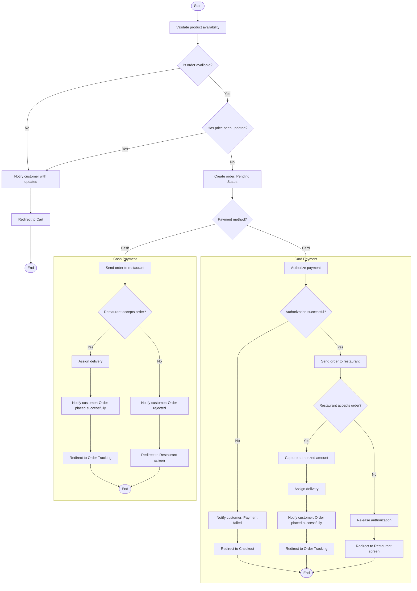
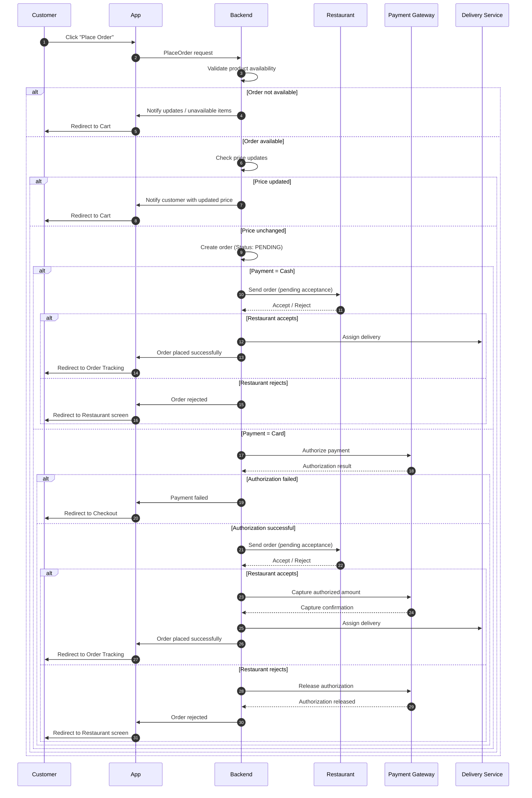
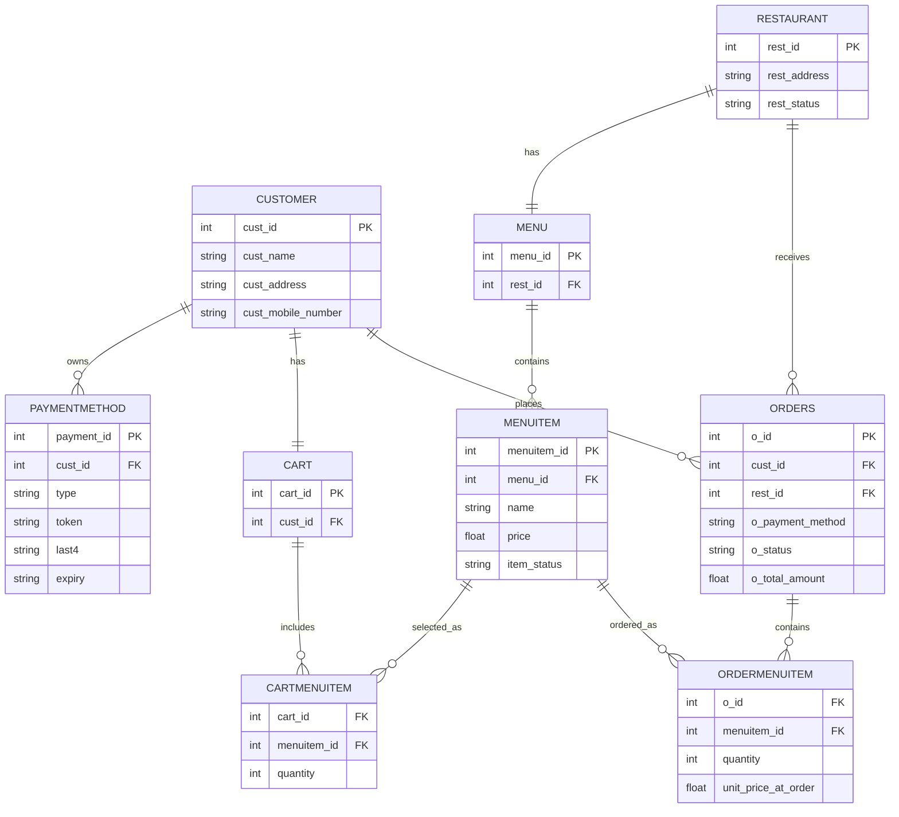

# Food Delivery App Functional Analysis  
**Case Study: Talabat**
---

## 📊 Part A — Analyst View
---

### 1. Authentication & Security Management

**Core Functions**
- User authentication (login)
- Third-party login 
- OTP verification (SMS or email)
- Password reset

---

### 2. Registration Management

**Functions**
- Create new account
- Register via email, mobile number or third-party provider

---

### 3. Account & Profile Management

**User-facing Functions**
- Update personal information (name, phone, email, photo)
- Manage delivery addresses (multiple saved addresses + labels home/work/..)
- Add debit/credit cards 
- Manage referral invitations (invite friends)
- Language and region settings
- Account upgrade (Pro/premium)
- Delete account 

---

### 4. Merchant Management (Restaurants & Stores)

**User-facing Functions**
- Browse merchants and categories
- Search for merchants
- Filter merchants (cuisine, discount, rating)
- Sort merchants (top rated, free delivery)
- Mark merchants as favorites

**Merchant Profile Page Displays**
- Ratings & reviews
- Delivery fees
- Opening hours
- Promotions
- Distance 

**Admin Functions**
- Add/edit merchant information

---

### 5. Product & Menu Management

**User-facing Functions**
- View menu items
- View product details (description)
- Product customization (add-ons)
- Select quantity
- Product suggestions 
- Recommended combos
- Out-of-stock indication

**Admin**
- Add/edit menu items

---

### 6. Cart Management

**Functions**
- Add/remove items
- Modify quantity
- Edit product customizations
- Apply promo or coupon codes
- Display fees, service fees, VAT
- Display ETA before checkout
- Delivery fee calculation

---

### 7. Order Management

**Functions**
- Place order
- Choose delivery location
- Change payment method
- Live Order Tracking
- Cancel order (rules dependent)
- Call  rider/driver
- Add delivery instructions/notes


---

### 8. Payment Management

**Functions**
- Support multiple payment modes:
  - Cash on delivery
  - Credit/debit card
  - Wallet balance
- Refund processing 
- Invoice/receipt generation

---

### 9. Loyalty Program

**Functions**
- Discount & promo codes
- Collect points per transaction
- Points redemption
- Partner integrations for point exchange

---

### 10. History & Reordering

**Functions**
- View past orders 
- Reorder from history
- Rate merchants

---

### 11. Search & Discovery

**Functions**
- Keyword search (merchant or food)
- Category discovery
- Location-based suggestions
- Trending merchants

---

### 12. Notification & Communication Management

**Functions**
- Push notifications (order updates, promos)
- Customer feedback 

---
---

## 🛠️ Part B — Technical View 
---

### 1. Analyze Place oreder Funcation
---

#### 1. Flowchart Diagram



#### 2. Sequence Diagram



#### 3. Pseudocode


```Pseudocode
PlaceOrder(Customer, Cart, PaymentMethod):

    for each item in Cart.items:
        if NOT CheckAvailability(item):
            Notify(Customer, item.name + " is not available")
            return CartPage

    server_total = CalculatePrice(Cart)
    client_total = Cart.total_amount

    if client_total != server_total:
        Notify(Customer, "Some item prices have been updated. Please review your cart.")
        return CartPage

    Order = CreateOrder(Customer, Cart, PaymentMethod, total_amount=server_total, status="PENDING")

    auth_ref = null

    if Order.payment_method == "CARD":
        auth_ref = AuthorizePayment(Customer, Order.total_amount)
        if auth_ref == null:
            UpdateOrderStatus(Order.id, "FAILED_PAYMENT")
            Notify(Customer, "Payment authorization failed")
            return CheckoutPage

    restaurantDecision = SendOrderToRestaurant(Order)   # "ACCEPTED" or "REJECTED"

    if restaurantDecision == "REJECTED":
        if Order.payment_method == "CARD":
            ReleaseAuthorization(auth_ref)

        UpdateOrderStatus(Order.id, "REJECTED")
        Notify(Customer, "Restaurant is busy right now. Please try again later.")
        return RestaurantPage

    if Order.payment_method == "CARD":
        captureOk = CaptureAuthorizedAmount(auth_ref, Order.total_amount)
        if NOT captureOk:
            UpdateOrderStatus(Order.id, "FAILED_PAYMENT")
            Notify(Customer, "Payment capture failed. Please try another payment method.")
            return CheckoutPage

    UpdateOrderStatus(Order.id, "CONFIRMED")

    AssignDriver(Order)
    Notify(Customer, "Order placed successfully!")
    return OrderTrackingPage
```

#### 3. Entity Relationship Diagram


